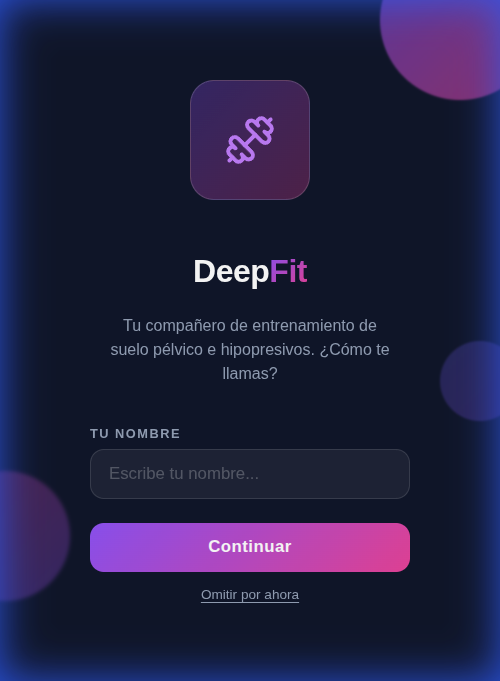
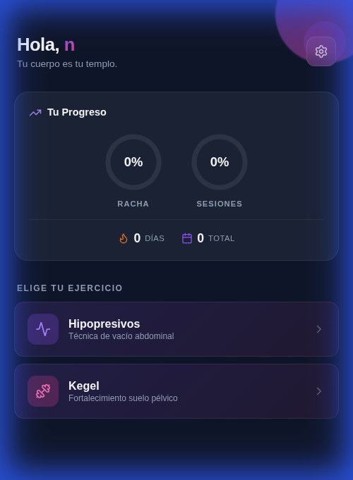
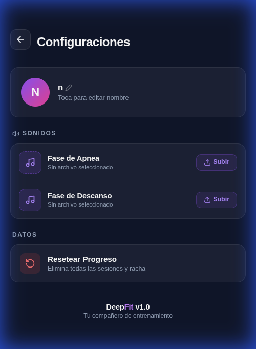
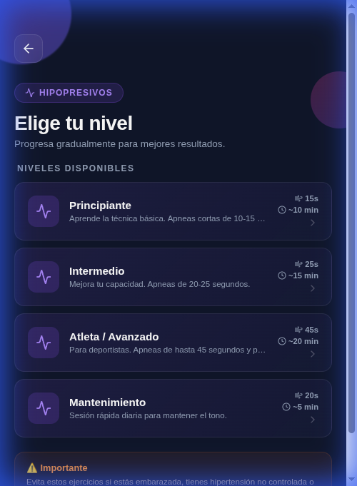
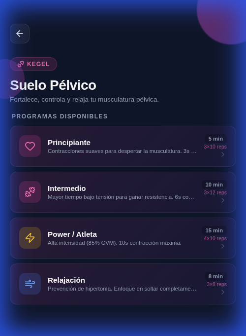
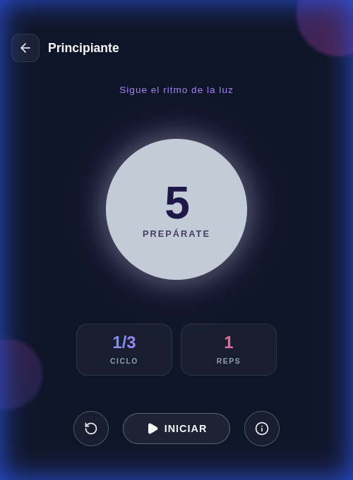

# 💪 DeepFit

<p align="center">
  <strong>Tu compañero de entrenamiento de suelo pélvico e hipopresivos</strong>
</p>

<p align="center">
  Aplicación móvil con ejercicios guiados de <b>Hipopresivos</b> y <b>Kegel</b>, diseñada para ayudarte a fortalecer tu suelo pélvico con sesiones personalizadas y seguimiento de progreso.
</p>

---

## ✨ Características

- 🧘 **Ejercicios Hipopresivos** — 3 niveles progresivos (Principiante, Intermedio, Atleta) con sesiones guiadas de inhalar, exhalar y apnea
- 💪 **Ejercicios Kegel** — 3 niveles con contracciones y relajaciones cronometradas por series y repeticiones
- 📊 **Seguimiento de progreso** — Racha diaria, sesiones totales y gráficos donut de avance
- 👤 **Perfil personalizado** — Nombre editable y experiencia personalizada


## 🛠️ Tecnologías

| Tecnología | Uso |
|-----------|-----|
| **Ionic React** | Framework UI móvil |
| **Capacitor** | Build nativo Android |
| **React + TypeScript** | Lógica de la app |
| **Vite** | Bundler rápido |
| **Lucide React** | Iconos |
| **CSS puro** | Estilos sin frameworks |

## 📱 Pantallas

<p align="center">
  
  
  
</p>

<p align="center">
  
  
  
</p>

## 🚀 Instalación

### Requisitos
- Node.js 18+
- npm o yarn
- Android Studio (para APK)

### Desarrollo local
```bash
# Clonar el repositorio
git clone https://github.com/deep-neo-studio/deepfit.git
cd deepfit

# Instalar dependencias
npm install

# Iniciar servidor de desarrollo
npm run dev
```

### Generar APK
```bash
# Build de producción
npm run build

# Sincronizar con Capacitor
npx cap sync android

# Abrir en Android Studio
npx cap open android

# O generar APK directamente
cd android && ./gradlew assembleDebug
```

## 📂 Estructura del proyecto

```
deepfit/
├── src/
│   ├── pages/          # Pantallas de la app
│   ├── hooks/          # Custom hooks (useProgress)
│   ├── data/           # Datos de ejercicios
│   ├── components/     # Componentes reutilizables
│   └── theme/          # Variables CSS globales
├── public/
│   └── sounds/         # Sonidos de la app
├── android/            # Proyecto Android (Capacitor)
└── index.html
```

## 👥 Equipo

**Deep Neo Studio** — Desarrollo de aplicaciones móviles y web

## 📄 Licencia

Este proyecto es privado y pertenece a **Deep Neo Studio**. Todos los derechos reservados.
